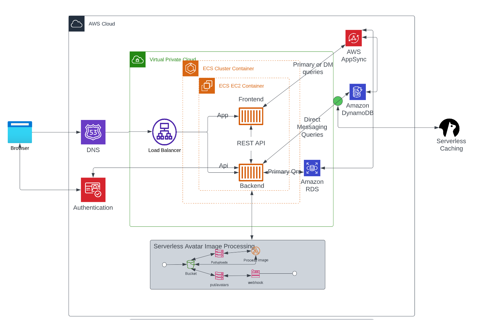

# Week 0 — Billing and Architecture
I've Started late due to some work tasks , but unfortunatly i was able to finish the essential tasks before the due date , being part a such an amazing experience is actually what made me do such an effort in a less time frame  
## required homework/Tasks


### Drew the Conceptual Diagram on a Napkin
Crudder Napkin design 


### Rebuild Logical Architectual Diagram in Lucid Charts 
[Lucid charts diagram link](https://lucid.app/lucidchart/85c6d8fc-2c57-4396-af11-61d7b74e7056/edit?viewport_loc=-213%2C-1294%2C2415%2C1252%2C0_0&invitationId=inv_9fed178f-ed26-4556-8470-7d7645f5984b)


### Install AWS CLI 

I performed the following steps to install AWS CLI using the Giptod terminal , steps , Instructions were mentioned on the [AWS CLI install Documention page](https://docs.aws.amazon.com/cli/latest/userguide/getting-started-install.html)

```
cd /workspaces
curl "https://awscli.amazonaws.com/awscli-exe-linux-x86_64.zip" -o "awscliv2.zip"
unzip awscliv2.zip
sudo ./aws/install

```

### Create a Billing Alarm 


### Create a Budget
