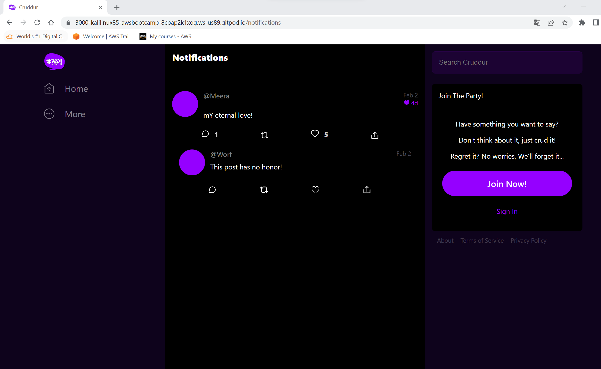

# Week 1 — App Containerization

## Dockerizing Backend 

- start with running python 

```python
cd backend-flask
export FRONTEND_URL="*"
export BACKEND_URL="*"
python3 -m flask run --host=0.0.0.0 --port=4567
cd ..
```
- Dont forget to unlock the port on port tab in gitpod 
- click on 4567 link on the browser 
- add the following to the link ```/api/activities/home```
- you should get back json 

## Add DockerFile 

start by creating a new docker file in the following path : ``` backend-flask/Dockerfile```

```DockerFile
FROM python:3.10-slim-buster

# Inside Container 
# Make a new folder inside the container

WORKDIR /backend-flask

# Outside Container -> Inside Container
#this contains the librairies want to install to run the app

COPY requirements.txt requirements.txt

# Inside Container 
# install the python libraries used for the app

RUN pip3 install -r requirements.txt


#outside container -> Inside container 
# . means everything in the current directory
# First period . - /backend-flask (outside container)
# Second period . - /backend-flask (insid container)

COPY . .


#set environment Variables (Env Vars)
#Inside container and will remain set when the container is running
ENV FLASK_ENV=development

EXPOSE ${PORT}

#cmd (command)
CMD [ "python3", "-m" , "flask", "run", "--host=0.0.0.0", "--port=4567"]
````
- Build backend-flask Container


```sh
docker build -t  backend-flask ./backend-flask
```

- Run backend-flask Container

```sh
docker run --rm -p 4567:4567 -it backend-flask FRONTEND_URL="*" BACKEND_URL="*" docker run --rm -p 4567:4567 -it backend-flask
```

### Containerize the front-react-js

- Create the DockerFile

```dockerfile
FROM node:16.18

ENV PORT=3000

COPY . /frontend-react-js
WORKDIR /frontend-react-js
RUN npm install
EXPOSE ${PORT}
CMD ["npm", "start"]
```

- Run NPM install

```sh
cd frontend-react-js
npm i
```

- Build front-react-js Container

```sh
docker build -t frontend-react-js ./frontend-react-js
```

- Run front-react-js Container

```sh
docker run -p 3000:3000 -d frontend-react-js
```

### Orchestra multiples containers

- Create docker-compose.yml

```yaml
version: "3.8"
services:
  backend-flask:
    environment:
      FRONTEND_URL: "https://3000-${GITPOD_WORKSPACE_ID}.${GITPOD_WORKSPACE_CLUSTER_HOST}"
      BACKEND_URL: "https://4567-${GITPOD_WORKSPACE_ID}.${GITPOD_WORKSPACE_CLUSTER_HOST}"
    build: ./backend-flask
    ports:
      - "4567:4567"
    volumes:
      - ./backend-flask:/backend-flask
  frontend-react-js:
    environment:
      REACT_APP_BACKEND_URL: "https://4567-${GITPOD_WORKSPACE_ID}.${GITPOD_WORKSPACE_CLUSTER_HOST}"
    build: ./frontend-react-js
    ports:
      - "3000:3000"
    volumes:
      - ./frontend-react-js:/frontend-react-js

# the name flag is a hack to change the default prepend folder
# name when outputting the image names
networks:
  internal-network:
    driver: bridge
    name: cruddur
```

- Run multiples Containers

```sh
docker compose -f "docker-compose.yml" up -d --build
```

  


- Stop multiples Containers

```sh
docker compose -f "docker-compose.yml" down
```

## Document the Notification Endpoint for the OpenAI Document

- Add the documentation to openapi-3.0.yml

```yaml
/api/activities/notifications:
  get:
    description: "Return a feed of activity for all of those that I follow"
    tags:
      - activities
    parameters: []
    responses:
      "200":
        description: Returns an array of activities
        content:
          application/json:
            schema:
              type: array
              items:
                $ref: "#/components/schemas/Activity"
```
## Write a Flask Backend Endpoint for Notifications

- Create the notification end point on app.py

```python
@app.route("/api/activities/notifications", methods=['GET'])
def data_notifications():
data = NotificationsActivities.run()
return data, 200
```

- Import the service

```python
from services.notifications_activities import *
```

- Create the notifications_activities.py [notifications_activities.py](../backend-flask/services/notifications_activities.py)

- Test the new endpoint


## Write a React Page for Notifications

- Map and import the notifications feed page on App.js

```javascript
import NotificationsFeedPage from "./pages/NotificationsFeedPage";
```

```javascript
{
  path: "/notifications",
  element: <NotificationsFeedPage />
}
```

- Create the NotificationFeedPage.js [NotificationFeedPage](../frontend-react-js/src/pages/NotificationsFeedPage.js)

- Test the notification menu



## Run DynamoDB Local Container and ensure it works


## Run Postgres Container and ensure it works

